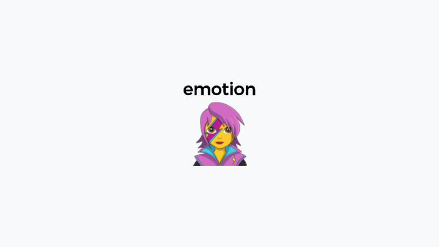
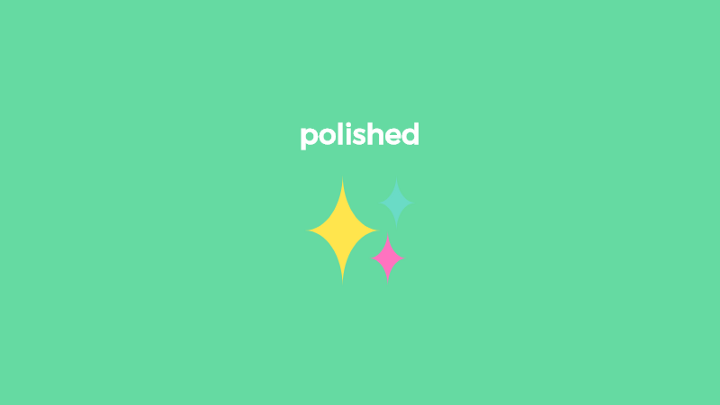

# styled-components

## styled-components는 CSS-in-JS 라이브러리 입니다.

💡 CSS-in-JS란?

JavaScript로 작성된 컴포넌트에 바로 삽입하는 스타일 기법

컴포넌트 기반 개발 방법이 주류로 자리잡음으로써 JavaScipt,HTML 뿐만 아니라 CSS도 컴포넌트에 삽입 할 수 있는 CSS-in-JS가 유행하고 있다.

`css 파일을 밖에 두지 않고, 컴포넌트 내부에 넣기 때문에 css가 중첩되지 않는다는 장점이 있습니다!`

<br>

### 고정 스타일

고정 스타일을 만들어두고 다른 React 컴포넌트에서 쉽게 불러와 사용할 수 있다.

```jsx
import React from "react";
import styled from "styled-components";

const StyledButton = styled.button`
  padding: 6px 12px;
  border-radius: 8px;
  font-size: 1rem;
  line-height: 1.5;
  border: 1px solid lightgray;
  color: gray;
  background: white;
`;

function Button({ children }) {
  return <StyledButton>{children}</StyledButton>;
}

----------------------------------------------------

import Button from "./Button";
<Button>Button Component</Button>
```

<br>

### 스타일에 props 적용

styled-components는 변수(props)에 따라서 스타일을 바꿀 수 있다.

```jsx
function Example() {
  const [email, setEmail] = useState("");

  return (
    <ExampleWrap active={email.length}>
      <NewButton color="blue">Im new Button</NewButton>
    </ExampleWrap>
  );
}

const NewButton = styled.button`
  color: ${(props) => props.color || "red"};
`;

export default Example;
```

<br>

### 여러개의 props를 넘기고 싶다면

```jsx
import React from "react";
import styled, { css } from "styled-components";

const StyledButton = styled.button`
  padding: 6px 12px;
  border-radius: 8px;
  font-size: 1rem;
  line-height: 1.5;
  border: 1px solid lightgray;

  ${(props) =>
    props.primary &&
    css`
      color: white;
      background: navy;
      border-color: navy;
    `}
`;

function Button({ children, ...props }) {
  return <StyledButton {...props}>{children}</StyledButton>;
}

---------------------------------------------------

import Button from "./Button";
<Button primary>Button Component</Button>
```

<br>

### Mixin css props

자주 쓰이는 css 속성을 담아둘 수 있습니다. 예를 들어 flex,, 같은

```jsx
const flexCenter = css`
  display: flex;
  justify-content: center;
  align-items: center;
`;

const FlexBox = div`
  ${flexCenter}
`;
```

<br>

## Styled-Components 단점

---

- css를 주고 싶다면 컴포넌트로 만들어야 하며 네이밍을 잘 못하게 된다면 가독성이 떨어질 수 있다.
- 하나의 컴포넌트의 스타일을 수정하고 싶다면 해당 컴포넌트의 파일 위치를 찾아야 한다는게 단점이 될 수 도 있지만 컴포넌트의 스타일을 하나의 파일에서 확인 할 수 있다는 장점이 될 수도 있는 것 같다.

<br>

## 대체할 수 있는 라이브러리

---



```jsx
const primaryStyle = css`
	background-color : #7795f8";
	color : "white";
`;

const Button = styled("button")`
  background-color: white;
  color: #7795f8;
  border: none;

  ${(props) => props.primary && primaryStyle};
`;
```

- emotion의 경우는 styled-components와 매우 유사하다.
- 동적이지 않은 스타일을 미리 컴파일하여 번들의 payload를 줄이는 babel 플러그인이 함께 제공된다.
- 스타일을 삽입 할 수 있는 템플릿 리터럴을 허용한다.

<br>



```jsx
import { complement, lighten, invert } from "polished";

const primary = {
  base: "#EEE",
  accent: "blue",
  text: "#666",
};

const secondary = {
  base: invert(primary.base),
  accent: complement(primary.accent),
  text: lighten(0.5, primary.base),
};
```

- 많은 mixin을 제공하고 있다.
- lighten, complement, invert, darken, rgba 등과 같은 기능을 활용해서 유용한 작업을 할 수 있다.
- 특히 색상 조정에 유용하다!

<br>


- 초기의 CSS-in-JS 라이브러리이다.
- styled-components와 비슷하게 react-jss의 도움을 받아 전역 스타일을 관리할 수 있고
  필요한 부분을 컴포넌트에 활용할 수 있다.

<br>


- zero-runtime, multi-variant 를 지원한다.
- variant API가 풍부해 컴포넌트에서 다양한 스타일링이 가능하고 좋은 유연성, 유지보수성을 제공한다
  또한 variant를 통해 스타일링 관심사 분리가 명확해진다.
- typescript 타입 제공이 가능하다.

`위에 명시된 라이브러리 말고도 많은 라이브러리가 존재한다..!`

<br>

## 그럼 나는..?

---

`styled-components가 좋아요`

- 스타일을 주기 위해 클래스 명을 고민하지 않아도 된다!
- styled-components 커뮤니티도 커지고 있고, 정기적으로 유지보수가 진행되고 있다!
- 컴포넌트와 각 컴포넌트의 스타일을 하나의 파일에서 확인하고 수정 할 수 있다!

### 여러 styled-components 사용 방법들,,

- 처음 styled-components를 사용할 때는 상단에 위치하는 방법을 사용했었다.

```jsx
import React from "react";
import styled from "styled-components";

const Container = styled.div``;
const Wrapper = styled.div``;
const Title = styled.span``;

function App() {
  return (
    <Container>
      <Wrapper>
        <Title>타이틀</Title>
      </Wrapper>
    </Container>
  );
}

export default App;
```

- 하지만 지금 하단에 위치하는 방법을 사용하고 있다.

```jsx
import React from "react";
import styled from "styled-components";

function App() {
  return (
    <Container>
      <Wrapper>
        <Title>타이틀</Title>
      </Wrapper>
    </Container>
  );
}

export default App;

const Container = styled.div``;
const Wrapper = styled.div``;
const Title = styled.span``;
```

### 왜 하단에 사용하나요?

- 파일에서 중요한 부분은 컴포넌트의 스타일 보다는 컴포넌트가 중요하다고 생각하기 때문
  - 즉! 파일을 열었을 때 컴포넌트의 구조부터 확인 할 수 있도록!
